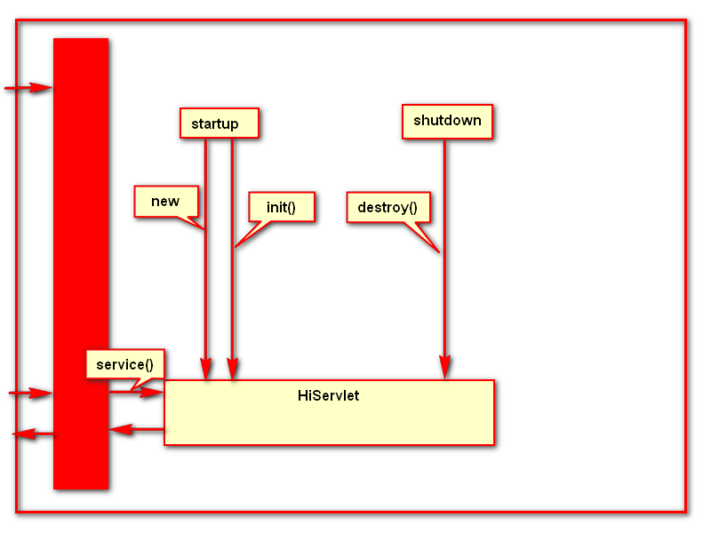

# JDBC

## JDBC接口

1. 驱动管理
	* DriveManager

2. 连接接口
	* Connection
	* DatabaseMetaData

3. 语句对象接口
	* Statement
	* PrepareStatement
	* CallableStatement

4. 结果集接口
	* ResultSet
	* ResultSetMetaData

## JDBC使用步骤

1. 导入JDBC的jar包
2. 加载驱动
3. 获取Connection对象
4. 创建Statement语句对象
5. 执行SQL语句
	- `execute(DDL)`常用于执行DDL,DCL
	- `executeUpdate(DML)`常用于执行DML语句
	- `executeQuery(DQL)`常用于之赐你个DQL语句
6. 处理执行结果
	- `execute(DDL)`如果没有异常则成功, 返回值为boolean, true为有数据集, false没有数据集
	- `executeUpdate(DML)`如果没有异常则成功, 返回数字, 更新记录的行数
	- `executeQuery(DQL)`如果没有异常则成功, 返回ResultSet结果集, 二维查询结果
7. 关闭数据连接!
	- 必须关闭, 否则数据库可能会瘫痪

>例:
```java
package com.jeson.jdbc;
import java.sql.Connection;
import java.sql.DriverManager;
import java.sql.ResultSet;
import java.sql.SQLException;
import java.sql.Statement;
public class JDBC {
	private static final String url = "jdbc:mysql://192.168.31.132:3306/db_jeson?user=jeson&password=password";
	private static final String sql = "SELECT * FROM users";
	static {
		try {
			// 2. 加载驱动
			Class.forName("com.mysql.jdbc.Driver");
		} catch (ClassNotFoundException e) {
			e.printStackTrace();
		}
	}
	public void start() {
		Connection conn = null;
		try {
			// 3. 获取连接
			conn = DriverManager.getConnection(url);
			// 4. 创建Statement对象
			Statement stmt = conn.createStatement();
			// 5. 执行SQL语句
			ResultSet result = stmt.executeQuery(sql);
			System.out.println("id\tname\t\tpassword\tage\tsex");
			// 6. 处理SQL执行结果
			while (result.next()) {
				System.out.println(result.getInt("id") + "\t"
						+ result.getString("name") + "\t"
						+ result.getString("password") + "\t\t"
						+ result.getInt("age") + "\t" + result.getInt("sex"));
			}
		} catch (SQLException e) {
			e.printStackTrace();
		} finally {
			// 7. 关闭连接
			if (conn != null) {
				try {
					conn.close();
				} catch (SQLException e) {
					e.printStackTrace();
				}
			}
		}
	}
}
```

## 读取属性文件, Properties

一种工具类, 用于读取属性文件, 一般以.properties作为后缀文件, 

实际上是一个hashtable
	
数据格式一般为`key = value`

### 使用方式

> 例: 定义数据库属性信息

```
jdbc.driverclass=com.mysql.jdbc.Driver
jdbc.url=jdbc:mysql://192.168.31.132:3306/db_jeson?
jdbc.user=root
jdbc.password=1230
```
> 例: 使用过程

```java
// 加载属性文件
Properties properties = new Properties();
// 不必手动关闭输入流, 它会自己关闭
properties.load(DBUtils.class.getClassLoader().getResourceAsStream("db.properties"));//db.properties在DBUtil所在的资源目录下
// 获取值
driverClass = properties.getProperty("jdbc.driverclass");
url = properties.getProperty("jdbc.url");
user = properties.getProperty("jdbc.user");
password = properties.getProperty("jdbc.password");
```

## 连接池

用于并发连接数据库, 因为数据库支持并发连接数有限, 避免连接过载, DB崩溃

### DBCP(database connect pool)

Apache的一个java连接池开源项目, 同时也是tomcat使用的连接池组件

连接池是创建和管理连接的缓冲池技术, 将连接准备好, 供需要他们的应用使用

> 例: 使用过程

```java
// 创建连接池核心组件对象
BasicDataSource bds = new BasicDataSource();
// 初始化连接池
bds.setDriverClassName("com.mysql.jdbc.Driver");
bds.setUrl("jdbc:oracle:thin:@192.168.0.24:1521:tarena");
bds.setUsername("system");
bds.setPassword("tarena");
// 设置连接策略
bds.setMaxActive(10);
bds.setInitialSize(1);
// 获取链接
Connection conn = bds.getConnection();
conn.close();
```

## PreparedStatement
	动态有条件执行SQL语句, 可以防止注入攻击(Statement可以直接将字符串进行拼接, 在DB执行, 不能够判断是数字还是SQL语句的关键词), Statement只适合执行静态(无条件)SQL

建立执行计划的优点:
1. 用于缓存通过检查的SQL
2. 下次发送相同的SQL时, 直接调用, 不必再次检查
3. 建立执行计划的目的是检查SQL的次数, 提高效率
4. 防止注入攻击

> 例: 

```java
Connection conn = bds.getConnection();
String sql = "SELECT * FROM tab_name WHERE id = ?;";
PreparedStatement ps = conn.getPrepareStatement(sql);
// 根据索引设置值, 索引从1开始
ps.putInt(1, 2);
ResultSet rs = ps.executeQuery();
while(rs.next()){
	System.out.println(rs.getInt("ename"));
}
```
## ResultSetMetaData
	描述数据的信息, 数据集合的一种概述, 一般包含查询结果的列数, 列名称, 列类型等等

> 例: 相关API

```java
// 获取列的数量
int getColumnCount();
// 获取第i列的列名
String getColumnName(int i);
// 获取第i列的列类型
String getColumnClassName(int i);
```
## 事务处理

### 事务
1. 原子性
	事务过程是完整不可分割的, 要么成功, 要么失败
2. 一致性
	事务前后数据要保持一致, 即收支平衡
3. 隔离性
	事务过程中的数据不能被别人访问, 需要收到隔离和保护
4. 持久性
	事务一旦完成, 就永久有效

### JDBC对事务的支持
	默认自动管理事务, 当调用`executeUpdate()`时, 自动提交事务

手动管理事务

```java
void conn.setAutoCommit(boolean);
void conn.commit();
void comm.rollback();
```

### 批量更新
JDBC支持将一条语句建立执行计划, 然后然后将多条记录的数据执行到数据库

> 例: 相关API

```java
// 将本条数据添加到批处理, 准备发送
void addBatch();
// 执行批处理, 发送暂存的一批数据
int[] executeBatch();
// 清除上一批数据, 以备下一批数据
void clearBatch();
```
> 例: 

```java
public static void main(String[] args) {
	Connection conn=null;
	try {
		conn=DBUtils.getConnection();
		conn.setAutoCommit(false);
		String sql="insert into emps(eid, ename, sal, deptno)values(seq_emps.nextval,?,?,?) ";
		PreparedStatement ps = conn.prepareStatement(sql);
		for (int i = 0; i < 108; i++) {
			ps.setString(1, "jack"+i);
			ps.setDouble(2, i*1000);
			ps.setInt(3, 1+10);
			ps.addBatch();
			if (i%30==0) {
				ps.executeBatch();
				ps.clearBatch();
			}
		}
		ps.executeBatch();	//余下不足30的单独发送
		ps.clearBatch();
		conn.commit();
	} catch (Exception e) {
		try {
			conn.rollback();
		} catch (SQLException e1) {
			e1.printStackTrace();
		}
	}finally{
		if (conn!=null) {
			DBUtils.closeConnection(conn);
		}
	}
}
```
### 执行SQL时获取字段值

```java
Connection conn = bds.getConnection();
conn.setAutoCommit(false);
// 先添加新部门到数据库
String sql = "INSERT INTO depts ( name )VALUES( ? )";
PrepareStatement ps = conn.prepareStatement(sql, new String[]{ id });
ps.setString(1, name);
ps.executeUpdate();
// 返回的结果集中存储的就是它记住的那些字段的值
ResultSet rs = ps.getGeneratedKeys();
rs.next();
int deptNo = rs.getInt(1);
```

## DAO
数据访问对象(Data Access Object), 数据封装思想, 建立在数据库和业务层之间 封装所有对数据的访问, 数据访问逻辑和业务逻辑分开

### 实现方式
一般先写实体类, 再根据逻辑写DAO

1. 一个DAO工厂类
2. 一个DAO接口
3. 一个实现DAO接口的具体类
4. 数据传递对象

### JavaBean

满足如下规范的类
1. 有package
2. 有`无参`构造器
3. 实现序列化接口
4. 有get/set方法

规则
1. 通常类名与表名一致
2. 通常该类中的属性名与字段一致
3. 通常该类中的属性都使用封装类型, 如 `Integer`代替`int`

***

# Servlet

## 开发Servlet

### 编写Servlet
1. 创建package
2. 创建一个类, 名为XXXServlet
3. 集成HttpServlet, 间接实现Servlet接口
4. 重写父类的service()

> 例: 重写`void service(HttpServletRequest request, HttpServletResponse response)`
```java
@Override
protected void service(HttpServletRequest request, HttpServletResponse response) throws ServletException, IOException {
	// 设置响应内容为text/html, 可以被浏览器展示, 否则浏览器不能识别, 会认为是下载文件
	response.setContentType("text/html");
	PrintWriter out = response.getWriter();
	Date date = new Date();
	SimpleDateFormat sdf = new SimpleDateFormat("HH:mm:ss");
	String now = sdf.format(date);
	out.println(now);
	out.close();
}
```

### 配置Servlet
1. 声明Servlet的类型, 并给它取一个别名
2. 通过别名引用Servlet, 并给它取一个网名(访问路径)
3. 部署
4. 访问
	- `http://ip:port/project_name/path`
	- `http://localhost:8080/Jeson-Web/now`

> 例: 编写web.xml
```xml
<?xml version="1.0" encoding="UTF-8"?>
<web-app xmlns:xsi="http://www.w3.org/2001/XMLSchema-instance"
	xmlns="http://java.sun.com/xml/ns/javaee" xmlns:web="http://java.sun.com/xml/ns/javaee/web-app_2_5.xsd"
	xsi:schemaLocation="http://java.sun.com/xml/ns/javaee http://java.sun.com/xml/ns/javaee/web-app_3_0.xsd"
	id="WebApp_ID" version="3.0">
	<display-name>Jeson-Web</display-name>
	<welcome-file-list>
		<welcome-file>index.html</welcome-file>
		<welcome-file>index.htm</welcome-file>
		<welcome-file>index.jsp</welcome-file>
		<welcome-file>default.html</welcome-file>
		<welcome-file>default.htm</welcome-file>
		<welcome-file>default.jsp</welcome-file>
	</welcome-file-list>
	<servlet>
		<!-- 设置组件别名 -->
		<servlet-name>time</servlet-name>
		<!-- 组件的类 -->
		<servlet-class>com.jeson.web.TimeServlet</servlet-class>
	</servlet>
	<servlet-mapping>
		<!-- 组件别名 -->
		<servlet-name>time</servlet-name>
		<!-- 访问路径, 需要以"/"开头 -->
		<url-pattern>/now</url-pattern>
	</servlet-mapping>
</web-app>
```

### Servlet工作流程
1. 根据访问路径解析出项目名和路径
2. 在web.xml下查找和路径匹配的`<servlet-mapping/>`, 并在该标签下找到别名`<servlet-name/>`
3. 根据别名在`<servlet/>`标签中查找相同别名, 找到后在该标签下找到类名`<servlet-class>`
4. 服务器加载找到的类, 并调用`service()`方法

流程图如下:


![Servelet流程图][1]

# HTTP协议
定义如何通信以及通信的数据格式

## 如何通信
一次请求一次连接, 降低服务器压力

1. 建立连接
2. 发送请求
3. 接受响应
4. 断开连接

## 数据格式
### 请求数据
* 请求行: 请求的基本信息
* 消息头: 请求数据的描述
* 空行: 分割
* 实体内容: 具体的业务数据

### 响应数据
* 状态行: 响应的基本信息, 数据由服务器自动填充
* 消息头: 响应数据的描述, 大部分数据由服务器填充, 但返回类型需手动指定
* 空行: 分割
* 实体内容: 具体的返回数据

> 例: 获取消息头信息
```java
// 迭代器模式
Enumeration<String> headers = request.getHeaderNames();
while (headers.hasMoreElements()) {
	String key = (String) headers.nextElement();
	String value = request.getHeader(key);
	System.out.println(key + ": " + value);
}
```

# Servlet运行原理

如图:


![Servlet运行原理][2]

# Servlet使用

## 设置编码

> 请求:
1. 万能方式, 将乱码后的字符串先按照乱码的编码转换为byte数组, 然后再以真正的编码格式转换比较麻烦
2. 针对GET请求路径, 在server.xml文件修改`<Connector />`标签, 添加属性`URIEncoding="utf-8"`
3. 针对POST请求实体内容, 在接受参数前, 调用`request.setCharacterEncoding("utf-8");`

> 响应:
1. 设置ContentType: `res.setContentType("text/html;charset=utf-8");`
2. 设置编码方式: `res.setCharacterEncoding("utf-8");`
Unit02 pm 16:30

## JavaBean

> 满足如下规范的类:
- 有单独的包
- 有默认的构造器
- 实现序列化接口
- 有get/set方法

> 建议:
- 尽量使用封装类型, 因为它比基本类型多了`null`
- 使用`java.sql`包下的日期, 因为JDBC支持这样的类型
- dao也要实现序列化接口

## GET/POST使用场景

> 建议:
- 查询数据时用GET, 因为通常查询条件较少
- 提交数据(表单)时用POST, 因为通常提交的数据较多

## 重定向

`response.sendRedirect("/find");`

使用场景

1. 解决两个网站之间的跳转问题
2. 解决一个网站内两个独立组件间的跳转
3. 一般增加,修改,删除后重定向

## 从request中获取访问路径

```java
// 结果为req.getServletPath()) = 
// 获取结果为相对路径, 可能为空, 因此此方法不可靠
System.out.println("req.getServletPath()) = " + req.getServletPath());
// 结果为req.getContextPath()) = /jeson-project
// 获取结果为项目路径
System.out.println("req.getContextPath()) = " + req.getContextPath());
// 结果为req.getRequestURI()) = /jeson-project/findAll
// 获取结果为用户用户访问路径的绝对路径
System.out.println("req.getRequestURI()) = " + req.getRequestURI());
// 结果为req.getRequestURL()) = http://localhost:8080/jeson-project/findAll
// 获取结果为浏览器路径
System.out.println("req.getRequestURL()) = " + req.getRequestURL());
```

## 如何配置Servlet访问路径
### 精确匹配

例: /abc

- 只有/abc才能访问这个Servlet
- 此Servelt只能处理这一个请求
- 适合规模比较小的项目

### 通配符
例: /*

- 所有路径都能访问此路径
- 此Servelt能处理所有请求
- 适合一个项目(某一个模块)只写一个Servelt

### 后缀(建议使用)
例: *.hi

- 所有以hi为后缀的请求都能访问此Servelet
- 此Servlet能处理多个请求
- 适合一个项目写少量的几个Servelt

## Servelt生命周期
管理Servlet的生命周期, 便于开发者在Servelt某个生命阶段做不同的处理

1. 默认首次访问Servlet时Tomcat实例化它, 也可以修改为启动Tomcat时就实例化(当前图为这种情况, 在web.xml的servelt标签下添加`<load-on-startup>1</load-on-startup>`, 中间的值为实例化的顺序)
2. 默认的执行顺序为new --> init() --> service() --> destroy
3. 每次请求都会执行service()
4. 每个Servlet都是单例模式

生命周期图:


![Servlet生命周期][3]

## ServletConfig和ServletContext

### ServletConfig
- 每一个Servlet实例配置一个ServletConfig
- 给单个Servlet预置数据时使用
- 在Servlet实例init()之前创建
- 可以在web.xml中配置

使用: 
在web.xml文件相应的Servlet标签下添加如下代码段
```xml
<init-param>
	<param-name>maxOnline</param-name>
	<param-value>1000</param-value>
</init-param>
```

在java文件中
```java
String maxOnline = getServletConfig().getInitParameter("maxOnline");
```


### ServletContext
- 单例模式, 整个项目中共享
- 给所有Servlet预置数据时使用
- 在Tomcat启动时就会创建

使用: 
在web.xml文件根标签web-app下添加如下代码
```xml
<context-param>
	<param-name>maxOnline</param-name>
	<param-value>1000</param-value>
</context-param>
```

在java文件中
```java
String maxOnline = getServletContext().getInitParameter("maxOnline");
```

技巧:

- 单独写一个`InitServlet`, 在`init(ServletConfig config)`方法中完成自己需要完成的初始化工作, 需要在web.xml文件这个Servlet相应标签下添加`<load-on-startup>1</load-on-startup>`, 不需要配置`servlet-mapping`
- 可以在ServletContext中设置变量, 记录某些值, 如访问次数

```java
// InitServlet下初始化属性initCount
getServletContext().setAttribute("initCount", 0);
// 其他Servlet设置initCount, 或者获取initCount值
getServletContext().getAttribute("initCount");
```

### Servlet接口及实现类
如图:


![Servlet接口及实现类][4]

### 线程安全问题

1. 尽量使用局部变量
2. 使用到全局变量时使用`synchronized`关键字

## JSP

### JSP表达式

- 语法规则: <%= ...%>
- 合法内容: 变量、变量加运算符组合的表达式、有返回值的方法
- 转译成Servlet时的规则: 在`service()`方法中用`out.print`语句输出该变量、表达式、方法的值

### JSP小脚本

- 语法规则: <% ...%>
- 合法内容: 能够写在方法里的java代码片段都可以作为小脚本
- 转译成Servlet时的规则: 原封不动成为Servlet类的`service()`方法里面的一段代码

### JSP声明

- 语法规则: <%! ...%>
- 合法内容: 成员属性或成员方法的声明
- 转译成Servlet时的规则: 成为JSP页面转译成Servlet类中成员属性或者成员方法

> 例:

- jsp文件

```jsp
<%@page pageEncoding="utf-8"%>

<!doctype html>
<html>
	<head>
		<meta charset="utf-8">
		<title>hello</title>
	</head>
	<body>
		<%!private double x100(double num) {
			return num * 100;
		}%>
		
		<ul>
		
			<%
				for (int i = 0; i < 10; i++) {
			%>
			
			<li><%=x100(Math.random())%></li>
			
			<%
				}
			%>
			
		</ul>
		
	</body>
</html>
```

- web.xml中的配置, 可以配置, 也可以不配置

```xml
<servlet>
	<servlet-name>hello</servlet-name>
	<jsp-file>/Hello.jsp</jsp-file>
</servlet>


<servlet-mapping>
	<servlet-name>hello</servlet-name>
	<url-pattern>/hello</url-pattern>
</servlet-mapping>
```

### JSP指令

- 语法规则: <%@指令名 属性=值 %>
- 作用: 控制JSP在转译成Servlet类时生成的内容
- 常用指令: page指令, include指令, taglib指令

### page指令

- 作用: 用于导包, 设置页面属性

> 例:

```jsp
<%-- 导包 -->
<%@page import="java.util.*" %>

<%-- 设置response.setContentType()方法的参数 -->
<%@page contentType="image/git" %>

<%-- 设置容器读取该文件时的解码 -->
<%@page pageEncoding="UTF-8" %>
```

### include指令

- 作用: 
1. 在JSP页面转换成Servlet时, 能够将其他文件包含进来. 可以包含JSP文件, 可以是静态的HTML文件.
2. 通过该语句能方便的在每个JSP页面中包含导航栏, 版权声明, logo等

- 语法: <%@include file="footer.html"%>

Unit05： 转发 、 JSP开发常见问题 am

### JSP页面中的隐含对象

- 输入输出对象
    - request: HttpServletRequest, 请求信息
    - response: HttpServletResponse, 响应信息
    - out: JSPWriter, 输出的数据流
- 作用域通信对象
    - session: HttpSeeesion, 会话
    - application: ServletContext, 全局的上下文对象
    - pageContext: PageContext, JSP页面上下文, 可以获取其他八个隐含对象
- Servlet对象
    - page: Object, JSP页面本身
    - config: ServletConfig, Servlet配置对象
- 异常对象
    - exception: Throwable, 捕获页面异常

### MVC模式
Model: DAO
View: JSP
Control: Servlet

> 例: Servlet转发

Servlet相关代码
```java
// 将数据放入emp属性中
request.setAttribute("emps", new ArrayList<>());
// 将请求转发到JSP文件中
request.getRequestDispatcher("/Emp.jsp").forward(request, response);
```

Emp.jsp相关代码
```jsp
<ul>
	<%
	    // 从隐含对象request中取出emps属性值显示
		for (EMP emp : ((List<EMP>)request.getAttribute("emps"))) {
	%>
	<li><%=emp.toString() %></li>
	<%
		}
	%>
</ul>
```


## Servlet转发和重定向

### Servlet转发

- 一次请求
- Servlet组件间跳转
- 表现在服务器端

### 重定向

- 两次请求
- 两个地址间的跳转
- 表现在客户端

### 使用

- 查询时用转发
- 增加, 修改, 删除后用重定向

## EL和JSTL表达式

### 初步使用EL表达式

```jsp
<!-- EL获取Bean的属性 -->
<!-- 和get/set对应的属性叫Bean属性, EL会通过类反射获取 -->
<!-- 下面一行代码相当于request.getAttribute("stu").getName() -->
<p>姓名: ${stu.name}</p>
<p>姓名: ${stu["name"]}</p>
<p>姓名: ${stu.course.id}</p>
```

### EL的取值范围

- EL依次从以下四个对象依次取值`page, request, session, application`, 这四个隐含对象是EL默认的取值范围
- 也可以指定取值范围, 例如从request中取值, `${requestScope.stu.name}`
- 设计默认取值范围是为了简化EL表达式, 不必经常写范围

### 使用EL表达式进行运算

- 算术运算: `+ - * / %`, 其中`+`只能进行算数运算, 不能做字符串的连接
- 逻辑运算: `&& || !`
- 关系运算: `> >= < <= == !=`
- 判空运算: `empty`, 判断字符串是否为空或者集合是否为空, 以下四种情况为true:空字符串, 空集合, 值为null, 找不到对应的值

> 例: EL表达式进行运算

```jsp
<p>年龄 + 5: ${stu.age + 5}</p>
<p>年龄 20~30: ${stu.age >=20 && stu.age <30}</p>
<p>判空: ${stu.course.empty}</p>
```

### 使用EL表达式获取请求参数值

```jsp
<!-- request.getParameter("name") -->
<p>姓名: ${param.name}</p>
<!-- request.getParameterValues("cities") -->
<p>姓名: ${paramValues.cities}</p>
```

### JSTL的简单使用

1. 将JSTL标签对应的jar文件复制到WEB-INF/lib目录下
2. 使用taglib指令导入要使用的JSP标签, 如`<%@taglib uri="" prefix=""%>`, uri表示JSP标签的命名空间, prefix表示命名空间的前缀

```jsp
<!-- if -->
<c:if test="${stu.sex=='M' }">男</c:if>

<!-- choose -->
<c:choose>
	<c:when test="${stu.sex=='M' }">男</c:when>
	<c:otherwise>女</c:otherwise>
</c:choose>

<!-- forEach -->
<!-- items: 声明要遍历的数据 -->
<!-- var: 每次循环所获得的数据命名 -->
<c:forEach items = "${stu.courses}" var = "course">
	${i.name}
</c:forEach>
```

### 自定义标签

// TODO

## 项目

1. 导包
    1. javaEE
    2. jdbc
    3. dbcp
    4. jstl

2. 开发步骤
    1. 根据操作分析本功能包含的请求
    2. 画图分析流程
    3. 按照执行流程的倒序逐个开发
       
### 异常

异常记录到日志中, log4j

### 访问网页

1. 浏览器访问服务器获取网页的过程包含多个请求
    1. 先获取网页
    2. 加载head
    3. 获取CSS, link标签
    4. 加载body
    5. 获取图片
2. WEB-INF目录具有保护作用, 放在其内的资源无法直接访问, 必须通过转发访问
    1. 如果jsp文件没有放到WEB-INF下, 就可以直接访问
    2. 在MVC模式下, 直接访问jsp会使其丢失数据来源, 导致报错
    3. 将其放到WEB-INF下, 就是保护jsp不被直接访问, 从而避免报错
    4. webApp下放置的静态资源可以直接被访问, 如CSS, img
 
### 配置错误页面

1. tomcat是所有服务器端代码调用的入口, 他在调用代码时会尝试捕获异常
2. 默认的它捕获到异常时会自动转发到对应的错误页面, 如404.html/500.html
3. 我们可以通过配置改变这个默认的行为, 明确告诉tomcat哪个异常去哪个错误页面, 这件事本身解决不了异常, 仅仅是让用户看起来更友好而已
4. 声明错误页面时需要写绝对路径, 但是由于是转发过去, 只能访问此项目内部资源, 所以tomcat会自动帮我们加上项目名

```
<!--通过异常类型进行配置-->
<error-page>
    <exception-type>java.lang.Exception</exception-type>
    <location>/WEB-INF/error.jsp</location>
</error-page>
<!--通过异常编号(404/405/500)进行配置-->
<error-page>
    <error-code></error-code>
    <location></location>
</error-page>
```

# cookie和session

作用:

1. 通俗理解
    - 这些数据在不同的请求中可以共用
    - 这些数据在不同的Servelt中可以共用
    - 每个浏览器都有这样一组数据
2. 专业描述
    - http是无状态协议, 即服务器没有记住浏览器
    - cookie和session就是用来管理状态的让服务器记住浏览器数据
    - 表名身份, 浏览器曾经访问过服务器的证据(数据)
    
## cookie

### 业务场景

- 登录时要记录账号
- 以后访问查询, 修改, 增加页面时要修改账号

### 前提条件

- 浏览器和服务器是多对一关系

### 使用如下对象

#### 错误情况

- request: 登录, 查询是不同的请求, 使用不同的request
- config: 开发时使用多个servlet处理不同的请求, 如登录用一个servlet, 查询用另外一个servlet, 多个servlet用不同的servlet,  没有读写变量的能力
- context: 会串包, tomcat只有这一个对象, 多个存入会有冲突

#### 正确情况

使用cookie或者session 

- cookie: 存储在浏览器上, 服务器压力小, 但数据不安全
- session: 存储在服务器上, 服务器压力大, 但数据安全

#### 使用情况

- 重要数据存在session上
- 一般数据存储在cookie上

### 使用

```java
protected void service(HttpServletRequest req, HttpServletResponse resp) 
        throws ServletException, IOException {
    String code =   req.getParameter("code");
    // 每个cookie只能存一条数据, 包括key或者value, 都是字符串
    Cookie cookie = new Cookie("code", code);
    // 将cookie发送给浏览器, 浏览器接收到会自动保存
    resp.addCookie(cookie);
}

protected void service(HttpServletRequest req, HttpServletResponse resp) 
        throws ServletException, IOException {
    //  获取cookie
    Cookie[] cookies = req.getCookies();
    if (cookies != null) {
        resp.setContentType("text/html;charset=utf-8");
        PrintWriter pw = resp.getWriter();
        for (Cookie cookie : cookies) {
            pw.println(cookie.getName() + ": " + cookie.getValue() + "<br/>");
        }
    }
}
```

### 特点

- 4K大小
- cookie保存在浏览器上
- 多个请求可以共用一组cookie
- 多个Servlet可以共用一组cookie
- 每个用户(浏览器)访问服务器, 都会获得一组cookie

### 生存时间

```java
cookie.setMaxAge(Integer.MAX_VALUE);
```

- second > 0: 浏览器要保存Cookie的最长时间为设置的参数值, 如果超过指定的时间, 浏览器会自动删除这个cookie, 此时保存到硬盘上
- second == 0: 删除cookie, 在修改cookie的生存时间为0后, 随着response发送回客户端, 替换原有的cookie, 因生命周期到了将直接删除
- second < 0: 缺省值, 浏览器会将cookie存储到内存中

### 路径

默认在某一个路径下创建的cookie, 只在相同路径下有效, 可以设置路径

```java
cookie.setPath("/");
```

## session

session大致工作流程

![session大致流程][5]


### 实现

```java
@Override
protected void service(HttpServletRequest req, HttpServletResponse resp) 
        throws ServletException, IOException {
    String code = req.getParameter("code");
    // 响应时服务器会自动创建cookie, 将session的ID通过cookie发送给浏览器
    // Cookie cookie = new Cookie("JSESSION", session.getId());
    HttpSession session = req.getSession();
    // 可以保存任意对象
    session.setAttribute("code", code);
}
```

```java
@Override
protected void service(HttpServletRequest req, HttpServletResponse resp) 
        throws ServletException, IOException {
    // 相当于req.getSession(true), 无论如何都会获取一个session
    HttpSession session = req.getSession();
    // 本次请求浏览器传入了SID, 服务器就根据此找到旧的session, 可以从中读取之前存储的数据
    session.getAttribute("code");
    // 销毁session, 退出, 注销功能  
    session.invalidate();
}
```

### 特点

- 浏览器第一次访问浏览器时, 服务器会给它创建一个session
- 服务器会使用cookie返回给服务器
- 浏览器再次访问服务器时会传入SID
- 多个Servlet可以共用一个session
- 不同的浏览器使用不同的session
- 仅访问Servlet不会创建Session, 转发jsp或者获取时才会创建, Session是jsp的内置对象

### 超时

为避免过度浪费空间, 默认超时时间为30分钟, 最短为1分钟, 但一般tomcat检查session时间间隔为2分钟

```xml
<!--在web.xml设置超时时间-->
<session-config>
    <session-timeout>1</session-timeout>
</session-config>
```

```java
// session 设置超时, 最短为1分钟
session.setMaxInactiveInterval(1);
```

### 注意

1. 在使用session返回验证码图片时,浏览器可能因为图片地址没有改变就不会再次访问, 需要做点小手脚

```java
// 路径可以改为
imageCode.jsp?x=Math.random();
```

# 过滤器

作用:

- 用来处理项目中的公共需求, 例: 记录日志, 过滤敏感词, 权限检查
    - 公共需求: 很过请求都包含的业务

使用

1. 创建一个类, 实现过滤器接口Filter
2. 在web.xml里面配置这个类, 过滤器由服务器自动调用

LogFilter.java

```java
public class LogFilter implements Filter {
    // tomcat启动时会自动实例化Filter, 探后调用其init来初始化Filter, 调用此方法时会传图config, 该对象和Filter是一对一关系, 可以给Filter在web.xml预置参数, 该对象和ServletConfig用法一致
    public void init(FilterConfig config) throws ServletException {
        System.out.println("LogFilter init!");
        System.out.println("name: " + config.getInitParameter("name"));
    }
    // Filter相当于Servlet 的管家, tomcat在调用Servlet之前会将请求提交给Filter, Filter有权请求的继续或者终止
    // tomcat就是调用doFilter方法统一处理请求, 调用前它会创建好request和response并传入
    // 创建的类型: RequestFacade和ResponseFacade
    public void doFilter(ServletRequest req, ServletResponse resp, FilterChain chain) throws IOException, ServletException {
        System.out.println("LogFilter doFilter start!");
        // 调用这个方法后才会将请求继续, 否则拦截
        chain.doFilter(req, resp);
        System.out.println("LogFilter doFilter end!");
    }
    // 关闭tomcat时自动调用此方法
    public void destroy() {
        System.out.println("LogFilter destroy!");
    }
}
```

web.xml

```xml
<filter>
    <filter-name>log</filter-name>
    <filter-class>com.jeson.test.LogFilter</filter-class>
    <init-param>
        <param-name>name</param-name>
        <param-value>Log</param-value>
    </init-param>
</filter>

<filter-mapping>
    <filter-name>log</filter-name>
    <!--声明此Filter可以过滤哪些请求-->
    <url-pattern>/*</url-pattern>
</filter-mapping>
```

# 监听器

## 生命周期相关的事件

容器创建或者销毁request, session, ServletContext时产生的事件

- ServletRequestListener
    - requestDestroyed(ServletRequestEvent enent)
    - requestInitialized(ServletRequestEvent enent)
- HttpSessionListener
    - sessionCreaterd(HttpSessionEvent event)
    - sessionDestroyed(HttpSessionEvent event)
- ServletContextLinster
    - contextDestroyed(ServletContextEvent event)
    - contextInitialized(ServletContextEvent event)

## 绑定数据相关的事件

调用了request, session, ServletContext的setAttribute(), removeAttribute()方法时产生的事件

- ServletRequestAttributeLinster
    - attributeAdded(ServletRequestAttributeEvent event)
    - attributeRemoved(ServletRequestAttributeEvent event)
    - attributeReplaced(ServletRequestAttributeEvent event)
- HttpSessionAttributeLinstener
    - 参考API doc
- ServletContextAttribute
    - 参考API doc

实现

RequestListener.java

```java
public class RequestListener implements ServletRequestListener {
    // tomcat销毁request前最后一刻调用此方法
    public void requestDestroyed(ServletRequestEvent event) {
        System.out.println("销毁request");
    }
    // tomcat创建request之后自动调用此方法
    public void requestInitialized(ServletRequestEvent servletRequestEvent) {
        System.out.println("创建request");
    }
}
```

web.xml

```xml
<listener>
    <listener-class>com.jeson.test.RequestListener</listener-class>
</listener>
```
    
Unit9  pm


  [1]: http://static.zybuluo.com/898801681/gbcm2zukdmrjiz080gxxa5yw/ServeletFlowChart.png
  [2]: http://static.zybuluo.com/898801681/3lkot5nk2fawpr64hcpu35ka/Servlet%E8%BF%90%E8%A1%8C%E5%8E%9F%E7%90%86.png
  [3]: http://static.zybuluo.com/898801681/p4sjwsld3ny5hiu6p8a9y4yt/Servlet%E7%94%9F%E5%91%BD%E5%91%A8%E6%9C%9F.png
  [4]: http://static.zybuluo.com/898801681/xnexb3p2ctdw6ybft8nkjh08/Servlet%E6%8E%A5%E5%8F%A3%E5%8F%8A%E5%AE%9E%E7%8E%B0%E7%B1%BB.png
  [5]: http://static.zybuluo.com/898801681/uz2b58s0k883qn9tseqgzngj/session_1.png